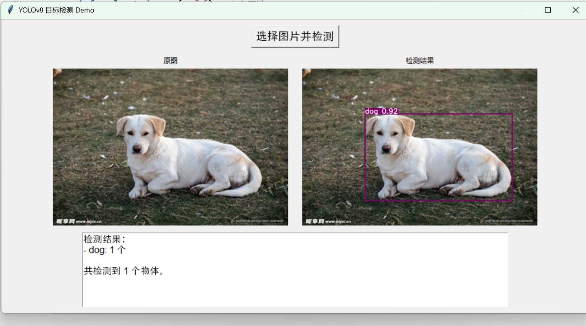

# YOLOv8 目标检测 Demo

## 效果展示

## 项目简介
一个基于 YOLOv8 的本地应用，可以自动识别图片中的物体并标注。

## 如何运行
1. 安装依赖：`pip install -r requirements.txt`  
2. 运行：`python app.py`  
3. 点击“选择图片并检测”，查看结果

## 技术栈
Python 3.9

YOLOv8 (Ultralytics) – 目标检测模型

OpenCV – 图像处理

tkinter – 桌面 GUI 框架（Python 标准库）

Pillow – 图像显示

## 项目结构
yolov8.py：主程序，包含模型推理与 GUI 界面

requirements.txt：展示 Python 依赖

screenshot.png：运行效果截图
## 后续计划
支持摄像头实时检测

使用自定义数据集微调模型

打包成 exe 文件，无需 Python 环境即可运行
## 作者
**`Jiaxiang He`**

**`[何佳翔]`** 